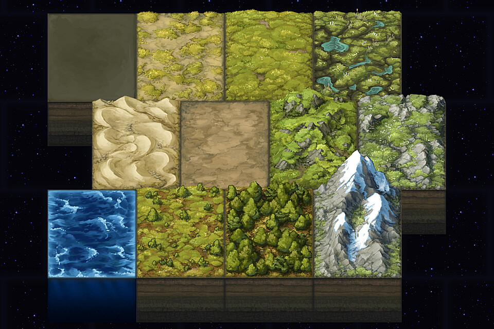
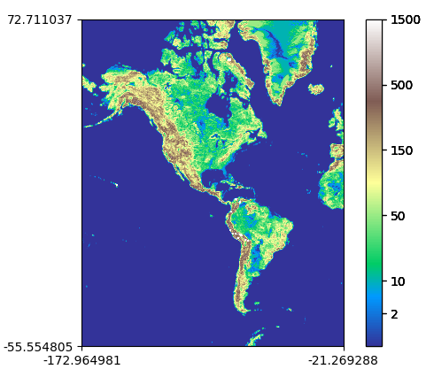

 

  

<h3 align="center">ASEIED 2023 project</h3>

  

    <b><i>Terrain tiles analysis for the western hemisphere</i></b>
     
    <i>Krzysztof Dymanowski, Bartosz Janicki, Alan Bejnarowicz</i>
     

  

<!-- TABLE OF CONTENTS -->

  
<b>Table of Contents</b>

  <ol>
    <li>
      <a href="#project-overview">Project Overview</a>
      <ul>
        <li><a href="#problem-formulation">Problem formulation</a></li>
        <li><a href="#tech-stack">Tech stack</a></li>
        <li><a href="#dataset">Dataset</a></li>
      </ul>
    </li>
    <li>
      <a href="#solution-process">Solution process</a>
      <ul>
        <li><a href="#aws-setup">AWS setup</a></li>
        <li><a href="#solution">Solution</a></li>
        <li><a href="#results">Results</a></li>
      </ul>
    </li>
    <li><a href="#summary"> Summary</a></li>
  </ol>

 

## Project Overview

This is a group project for 2023 ASEIED class (Autonomous systems for exploring and analyzing data) at Gdańsk Tech. The goal of course was to gain hands-on experience with AWS, especially with EMR and other big data tools utilized in the industry.

### Problem formulation

"Perform data analysis containing information about the terrain elevation diversity, selecting groups of areas with the highest increase (North and South America continent). The elevation increase in a given location should be measured based on at least 10 measurement points. Determine 6 groups of areas based on the average value of elevation increase. Please plot the detected areas on the map."

### Tech stack

* [![Python][Python-logo]][Python-url]
* [![Spark][Spark-logo]][Spark-url]
* [![AWS][AWS-logo]][AWS-url]

The AWS environment this project was run on was AWS Learning Lab, in which every one of us had 100$ to spend on Amazon web services.

[Python-logo]: https://img.shields.io/badge/Python-3776AB?style=for-the-badge&logo=python&logoColor=white
[Python-url]: https://www.python.org/
[Spark-logo]: https://img.shields.io/badge/Spark-E25A1C?style=for-the-badge&logo=apache-spark&logoColor=white
[Spark-url]: https://spark.apache.org/
[AWS-logo]: https://img.shields.io/badge/AWS-232F3E?style=for-the-badge&logo=amazon-aws&logoColor=white
[AWS-url]: https://aws.amazon.com/

### Dataset
Dataset used was the terrain tiles dataset:  
https://registry.opendata.aws/terrain-tiles/
which is:
 "A global dataset providing bare-earth terrain heights, tiled for easy usage and provided on S3."

Specific bounding box used for analysis was:

| Coordinates   | From            | To         | 
|---------------|:---------------:|------------|
| Latitude      |   72.711037     | -55.554805 |
| Longitude     |   -172.964981   | -21.269288 |

The bounding box was found using the http://bboxfinder.com website.

## Solution process

Our approach was to use the Merocator projection (https://en.wikipedia.org/wiki/Mercator_projection) to map the selected region's surface onto a 2d plane, which in turn allowed us to perform precise tile analysis of the elevation.

Here are the most important steps of our pipeline:

1. Generating tile coordinates based on geogprahic bound and zoom level (Bounds specified above, zoom level = 3):
`tiles: List[Tile] = get_tiles(ZOOM, *BOUNDS)`
2. Based on the list of tuples containing (zoom level, x coordinate, y coordinate) we fetch the elevation data from S3:
`data_urls: List[str] = generate_links(tiles)` 
3. We proceed to load the data into a Spark dataframe (specifying the image format):
`df = spark.read.format("image").load(data_urls)`
4. The DataFrame is pruned to include only the 'origin' and 'data' columns (metadata and actual images respectively):
`df = df.select("image.origin", "image.data")`
5. The DataFrame is converted to an RDD of numpy arrays for easier manipulation:
`tiles_rdd = df_images.rdd.map(lambda img: np.reshape(img, (TILE_HEIGHT, TILE_WIDTH, CHANNELS_NUM)))`
6. Afterwards elevation data is calculated for each tile based on the RGB values of the image, and we calculate gradients of terrain using numpy:
`elevation_tiles = tiles_rdd.map(get_elevation)`
`grad_arr = elevation_tiles.map(np.gradient)`
7. Then we populate an empty numpy array according to the elevation level for each tile and display the results.
`plt.imshow(world_map, cmap=plt.get_cmap("terrain"))`

### AWS setup
In order to reproduce results:
1. Create a cluster specified by the cluster creation command specified in file `clone_cluster_command.txt` (You can use any other configuration for the cluster, but we suggest having at least 5 m5.xlarge instances in the cluster).
2. Attach notebook (or workspace in the new console) to the cluster and run all cells of the "raw" notebook.

Alternatively you can link this repository to your notebook(cluster) and then run the "raw" notebook.
### Solution
Our approach was

### Results

We deduce our calculation methods are rather correct, as plotting the obtained elevation map with `terrain` color map from matplotlib yields an image similar to one we can find in geography books and other kinds of maps.

### Summary
Our initial attempt was to write this project in Scala (Spark), but along the way we pivoted to PySpark. The experience we gained was more or less the same, however we were spared having to deal with many technicalities/areas where achieving the same thing with Scala was much harder than in Python (For example, setting up Vegas to work in the notebook was a mountain to overcome compared to PySpark's `sc.install_pypi_package("matplotlib")`) Nonetheless we obtained hands-on experience with Scala and Spark, and transferred our knowledge to PySpark.